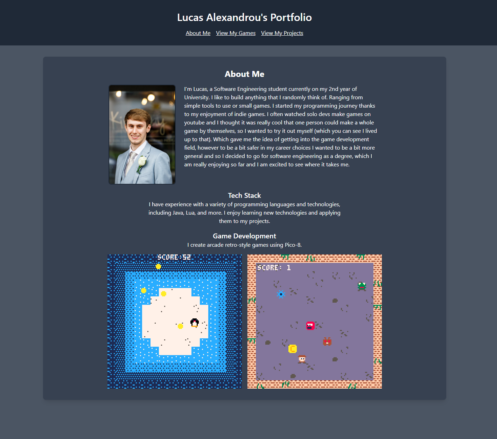
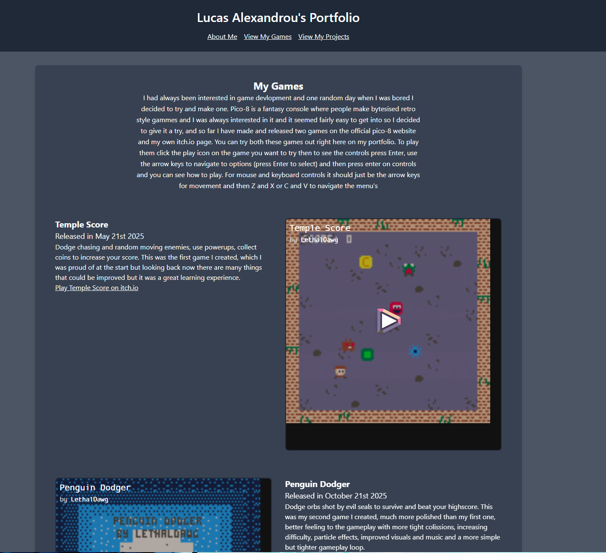

# lucasalexandrou.github.io

Visit my portfolio [here](https://lucasalexandrou.github.io)

This is a Github Page website that I built using HTML, CSS and JavaScript. I wanted to create a portfolio website to showcase my projects and skills, and I thought it would be a great opportunity to learn more about web development.
I used Tailwind CSS for styling and to make the website responsive, and I used JavaScript to dynamically load the content for each section of the website. As the website is hosted on Github Pages, I am able to easily update and maintain it.I believe I was able to create a clean and simple design that does it's job of showcasing some of my projects. I plan to continue improving and updating the website as I create more projects and gain more experience in web development.

